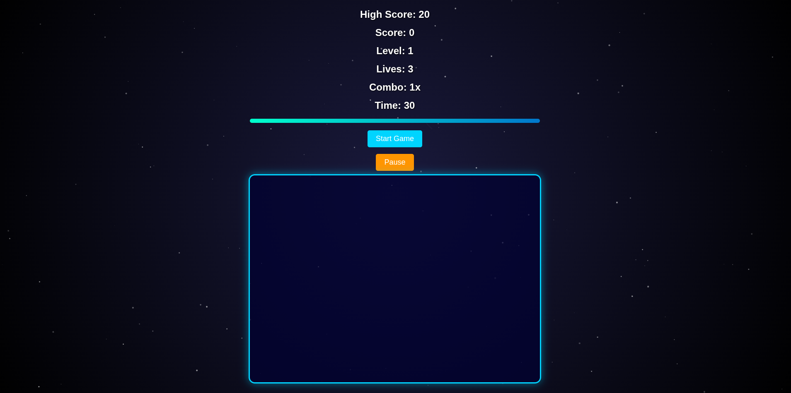

# Start_Frenzy

Star Frenzy is a fast-paced, interactive browser game built with pure HTML, CSS, and JavaScript. Players must click moving targets within a limited time, manage lives, build combos, and collect power-ups — all set against a dynamic animated starfield background.

🚀 Features

🎯 Dynamic Target Clicking

Normal and bonus targets with different point values

Targets shrink over time, increasing difficulty

🔥 Combo & Multiplier System

Consecutive hits increase combo multipliers

Rewards fast and accurate gameplay

⚡ Power-Ups

Double score

Slow-motion targets

Timed effects with visual feedback

🌌 Animated Starfield Background

Canvas-based twinkling stars

Random shooting stars for immersive visuals

⏱️ Game Mechanics

Countdown timer with progress bar

Level progression based on score

Limited lives system

🏆 High Score & Leaderboard

Persistent high score using localStorage

Top 5 leaderboard stored locally

🔊 Sound Effects

Hit, bonus, power-up, life lost, and game-over sounds

⏸️ Pause & Resume

Fully functional pause system that freezes animations and timers

🛠️ Technologies Used

HTML5

CSS3

Animations

Gradients

Responsive design

JavaScript (Vanilla)

DOM manipulation

Game logic

Canvas API

Local Storage

📂 Project Structure
/
├── index.html   # Main game file (HTML, CSS, JS included)

No external libraries or frameworks required.

▶️ How to Run the Game

Clone or download this repository:

git clone https://github.com/your-username/star-frenzy-game.git

Open the project folder.

Double-click index.html or open it in any modern web browser.

Click Start Game and enjoy 🎮

🎮 How to Play

Click targets before they disappear

Bonus targets give extra points

Maintain combos to increase your score multiplier

Collect power-ups to gain temporary advantages

Avoid missing targets — you lose lives!

Try to beat your high score and make the leaderboard

💡 Learning Highlights

This project demonstrates:

Real-time game loops with setInterval and requestAnimationFrame

Canvas-based background animation

CSS animations synchronized with JavaScript logic

State management (pause, resume, game over)

Persistent data storage with localStorage

Responsive UI design without frameworks

📸 Screenshots (Optional)

Add screenshots by placing images in your repo and referencing them like this:

📄 License

This project is open-source and free to use for learning and personal projects.
